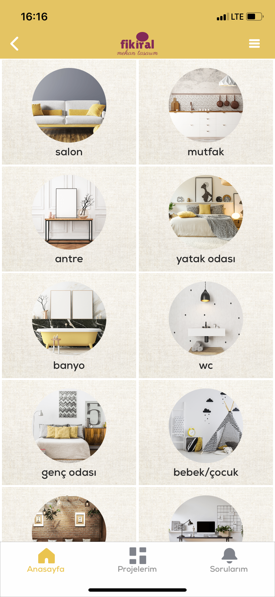

# FikirAl

It is an application where those who renovate their home, cafe, office or furnish them from scratch can upload photos and get architectural design ideas in their
decoration shopping.

Used technologies: RestAPI, Moya, Cocoapods.

Created using swift 5 and it is on the AppStore.

I cannot include the source code due to company privacy.

 
